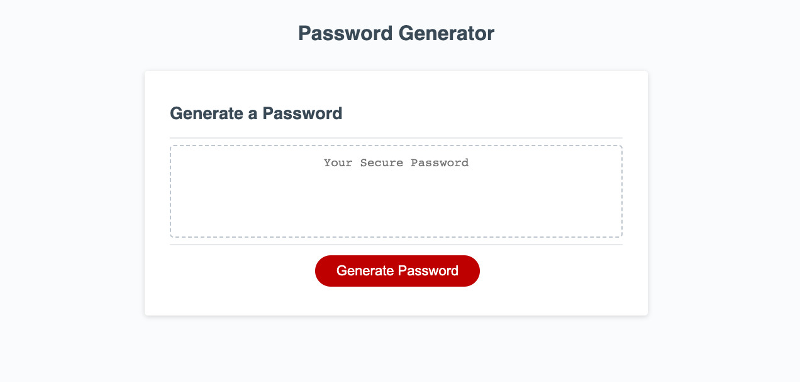

# Password Generator

A random password generator, better than LastPass or BitWarden!

[This is an external link to his portfolio](https://rhodemc.github.io/md3-password-generator-repo/)

## Description

I was motivated to create a password generator because having unique, random passwords is important for modern internet use.

Using a random password generator allows for ease of use and quick selection and randomization. It's a great resource for people who want every app login to have a unique, random password.

When using this password generator, you'll find a responsive Generate Password button and the ability to customize length and characters used.

## Installation

N/A

## Usage

To enjoy this site, click the Generate Password button in the center of the page. Once clicked, a prompt and series of confirmation windows will allow you to specify your random password based on character length and inclusion or exclusion of numbers, lowercase letters, uppercase letters and special characters. Once the parameters have been specified, the password generator will provide you with a random password.

## Credits

This portfolio's code was written with help from Xandromus' starter code.

[This is an external link to Xandromus' starter code](https://github.com/coding-boot-camp/friendly-parakeet)

## License

Please refer to the LICENSE in the repo.
